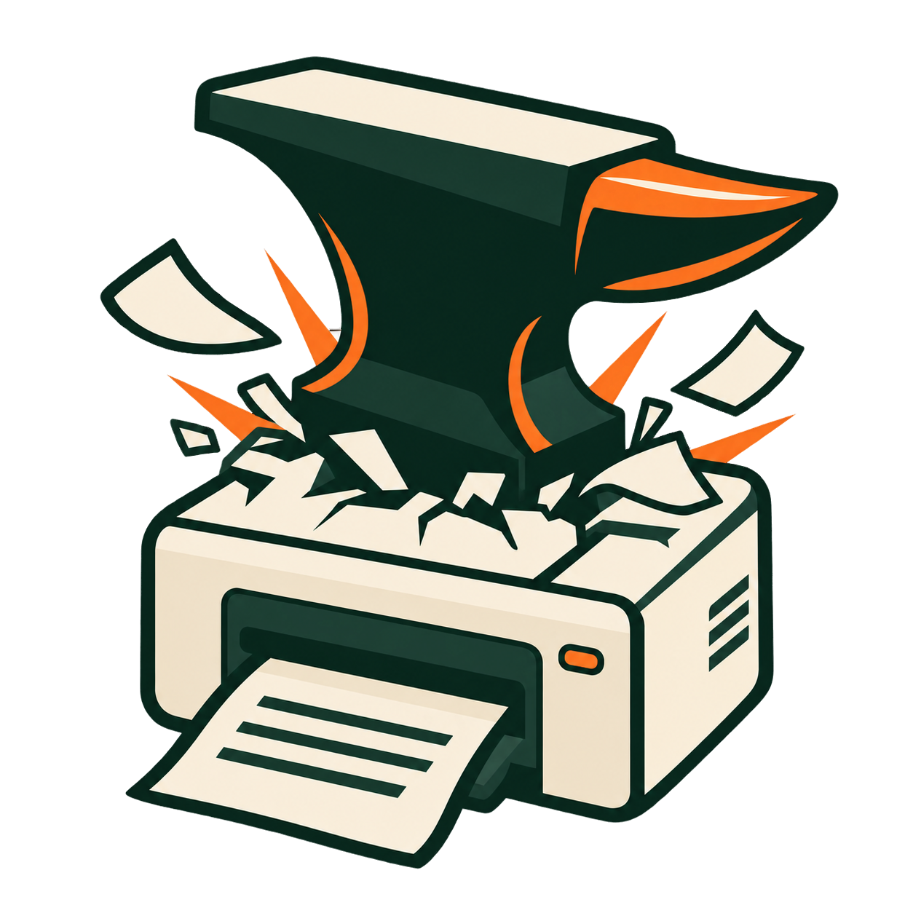

# SpoolSmith

<p align="center"></p>

SpoolSmith discovers network printers, saves reusable printer profiles, copies a working
printer setup from one PC to another, and maps Windows queues using locally installed
drivers after you review the plan. A small family catalog also provides automatic
identification and driver guidance.

**The current release (see [VERSION](VERSION) and [releases/](releases/) for exactly which)
includes the command-line tool and the native Windows desktop app.** The desktop mirrors the
copy, apply, installed-printer inventory, address-change, offline setup, local-status and
Intune-packaging workflows. Saved setups use .ssb printer files and can be exported and imported together as a set.

The underlying copy and offline workflows have real Windows 11 validation; see
[Current limitations](#current-limitations) for the validation boundaries, and
[releases/](releases/) for what shipped in which version. Automatic driver downloads
remain outside the shipped surface. Intune packaging (below) is local-only Win32-app
export from both the CLI and the desktop GUI — it does not sign in to a tenant or
upload/assign anything.

## Upgrading to v1.1

Every saved printer now uses an `.ssb` bundle, with optional driver files, and
several printers travel together as a printer set: a plain `.zip` of `.ssb` files.
Copies include the driver whenever they can (`--settings-only` opts out).
Existing `.ssb` bundles remain supported. Older bare-JSON profiles and JSON
library exports are no longer read. Keep them for reference and recreate each
setup by copying its installed queue or running `profile capture` with its
address and driver. Renaming a JSON file does not convert it. Existing Windows
printers are unaffected by upgrading SpoolSmith.

## Copy a printer from one PC to another

The case this exists for: someone needs a printer, someone else already has it working, and
you would rather not rediscover the driver name, the address, and the port settings by hand.

On the PC that already prints:

```powershell
# What does this PC have? (read-only; wraps Get-Printer and Get-PrinterPort)
spoolsmith printers

# Copy one of them. Omit the queue name to pick from a numbered list;
# omit the file name to have it named after the queue.
spoolsmith copy "Accounting" accounting.ssb
```

A `.ssb` is one printer. The copy includes the driver whenever it can: SpoolSmith exports
the driver package out of the Windows driver store so the target PC does not need it
beforehand. That export needs an elevated prompt. When it can't happen (not elevated, the
export fails, or the package is above the 1 GiB bundle limit), the copy still succeeds as
settings only and says why; the target PC must then already have that driver registered.
`--settings-only` always leaves the driver out. `--include-driver` is no longer needed and
is accepted as a no-op with a note.

For a PC replacement with several printers, copy every supported queue in one pass into
one **printer set**:

```powershell
spoolsmith copy --all printers.zip
```

A printer set is a plain `.zip` with one `.ssb` per printer at its root, nothing else. Omit
the name to get `SpoolSmith-printers-<date>-<time>.zip` in the current folder. Each printer
gets its own `.ssb` (duplicate names get `-2`, `-3` suffixes) and carries its driver where
possible, exactly as a single copy would. A queue that can't be reproduced is skipped with a
reason; one that fails doesn't stop the others. Stopping the copy (Ctrl+C) saves no set, and
an existing file is never replaced. `--note` is stored as the zip comment. Zipping `.ssb`
files yourself (for example with Explorer's **Compress to ZIP file**) also makes a valid set.

The desktop offers the same by selecting printers on **This PC** (Ctrl+A for all) and choosing **Copy N printers...**: a **Save set as**
`.zip` name, **Include each printer's driver where possible** (on by default), progress, a
stop control and a result for every printer. **Copy results** puts a plain-text report on
the clipboard for your ticket.

Copy `accounting.ssb` (or the set) to the other PC however you normally move a file, then:

```powershell
# Read the bundle without touching the network or this PC
spoolsmith bundle inspect accounting.ssb

# Preview against the real printer, then apply after one confirmation
spoolsmith apply accounting.ssb --dry-run
spoolsmith apply accounting.ssb

# A printer set: list its printers, then apply them one at a time
spoolsmith bundle inspect printers.zip
spoolsmith apply printers.zip --dry-run
spoolsmith apply printers.zip
spoolsmith apply printers.zip --member Accounting
```

With a set, every printer gets its own plan and its own confirmation, exactly as if its
`.ssb` had been applied alone; one confirmation never covers several printers. `--member`
picks one printer by file name (with or without `.ssb`). A summary at the end lists each
printer's result.

`apply` re-checks the printer's live identity against what was captured at copy time, so it
fails closed if the address now answers as a different device. When the printer is not
reachable or cannot confirm its identity, setup automatically falls back to offline
and says so in the plan before you confirm it. `apply --offline` skips the live check
from the start. Copying an unreachable printer still saves Windows queue settings,
with its identity clearly marked unconfirmed.

A bundle is a plain zip: a manifest carrying configuration and provenance, and optionally the
exported driver files, each listed with its size and SHA-256 and verified on extraction. It
contains no commands. The hashes are tamper-evidence, not a signature — the trust anchor for a
driver payload is Windows' own catalog signature check when `pnputil` stages the INF. Because
copies now include drivers by default, this is the check that decides whether a driver
exported from another PC gets installed: a payload that fails its hashes or the Windows
signature check is refused. Use `--settings-only` when the destination should rely on a
driver you install yourself.

### Rolling the same reviewed setup out to several PCs

`--dry-run` prints a fingerprint of the exact plan you reviewed. Passing it back with
`--plan-hash` accepts that one plan and refuses every other, so a machine that would have
computed something different stops instead of mutating:

```powershell
spoolsmith apply accounting.ssb --dry-run          # prints: Reviewed plan fingerprint: 5364...
spoolsmith apply accounting.ssb --plan-hash 5364...
```

This is narrower than `--yes`, not broader: `--yes` accepts whatever plan the machine computes,
sight unseen. A fingerprint names one printer's plan, so with a multi-printer set, pair
`--plan-hash` with `--member <name>`.

### Queues that cannot be copied

`printers` marks these with `!` and states why. SpoolSmith only reproduces RAW TCP 9100 queues
pointed at a literal IP address, because anything else would quietly build a different queue on
the next PC. An LPR queue, a non-9100 port, a port naming a host rather than an address, and
"Microsoft Print to PDF" are all refused rather than approximated.

## Native Windows GUI

Download and extract the [Windows release ZIP](https://github.com/spilloid/spoolsmith/releases/latest),
then open `spoolsmith-gui.exe`. No Go installation is needed. Its application
manifest is embedded, so the executable can be copied or renamed freely.

For developers building the desktop from source:

```powershell
go build -ldflags="-H windowsgui" -o dist/spoolsmith-gui.exe ./cmd/spoolsmith-gui
```

The sidebar holds the app's one job: **This PC** (take printers off this PC) and **Add a
printer** (put them on). **Intune package**, **Inspect**, **Action log**
and **Saved setups** are under **More** at the foot of the sidebar. The window opens at
1060×720 and can shrink to 960×640.

The app opens on **This PC**, a table of Windows' installed printers; ones SpoolSmith
can't copy (such as Print to PDF) are greyed with their reason. Select printers and choose
**Copy 1 printer...** or **Copy N printers...** (one printer saves a `.ssb`, several save one
set `.zip`), or press **Ctrl+C** to put the printer files on the clipboard and paste them
into a folder, share or chat. **Include the driver where possible** is on by default, as on
the CLI. Exporting driver files requires administrator rights; without elevation, or when
the export fails, the copy is saved with settings only and the result says why. With one
printer selected, **Change address...** and **Remove printer...** appear.

**To install a printer file, double-click it.** SpoolSmith offers once to open `.ssb`
files when you double-click them (for your Windows account only; turn it off under
**More**). You can also drop printer files or sets onto the window, paste them (**Ctrl+V**)
after copying them in Explorer, pass one on the command line (`spoolsmith-gui.exe
printer.ssb`), or use **Add a printer → Open a printer file...**. A second double-click while
SpoolSmith is open goes to the window that's already open.

Every change opens the **apply sheet**: the printer's name, address and driver, where the
file came from, anything to know first (settings only, printer not answering), and the
steps it will take, prepared as soon as it opens. **Details** shows the full plan;
**More options** offers offline setup, updating an existing queue and, for removals,
removing the driver. The main button asks for the usual single confirmation of that plan.
If SpoolSmith isn't running as administrator, the button reads **Install as
administrator...** with the Windows shield: Windows asks for permission, SpoolSmith
reopens elevated on the same printer, prepares the preview again and asks you to confirm
it there. When it finishes, the sheet shows each step's result and **Copy notes for the
ticket** puts a plain-text summary on the clipboard.

**Add a printer** lists the printers found on the network the PC is connected to, scanned
when the app starts. **Scan a different network or IP...** takes a subnet, or one address
with **Use IP directly**. Choose a compatible installed driver and **Save and review**. A printer set `.zip` opens a
**Printer set** list where you pick one printer at a time, and each goes through its own
sheet and confirmation (the CLI's `bundle inspect` reads either without applying it).
**More → Inspect** can also verify a bundle or set and show what it contains without
contacting the printer. **More → Intune package → Build an Intune printer app...**
packages a reviewed profile into a local, reviewable Win32 app bundle — see [Intune
packaging](#intune-packaging).

**More → Saved setups** lists reusable profiles. Set up, update, remove, edit with a
backup, or **Check status** against local Windows configuration. Status does not
prove reachability or printing. **Open another folder** switches the profile library.
The default library sits beside the executable; `SPOOLSMITH_PROFILES_DIR` can override it.

**Export all...** saves every `.ssb` in the current folder into one printer set (`.zip`),
byte for byte, including any driver a file carries. **Import all...** validates every
printer in a set, extracts each one byte for byte, and refuses existing filenames
(including case-only clashes). Both actions show a review of filenames, printer settings,
whether each carries a driver, external archive references and destination conflicts.
The transfer is pinned to what you reviewed: a printer file or set that changes after the
review is refused, and you review again. Choose another destination within the review;
importing switches the library to that folder after saving. Import saves files only; each
Windows change still needs review and confirmation. A referenced vendor archive
(`driver_package`) is a path, not an embedded driver: carry it separately and preserve its
relative path beside the imported printers. Keep set exports outside the saved-setup folder.

The CLI exposes the same transfer:

```powershell
spoolsmith profile export-all profiles printer-setups.zip --dry-run
spoolsmith profile export-all profiles printer-setups.zip
spoolsmith profile import-all printer-setups.zip imported-profiles --dry-run
spoolsmith profile import-all printer-setups.zip imported-profiles
```

Transfer `--dry-run` writes no files and reports all filename conflicts. Actual imports
recheck the destination before writing. A set holds at most 1,000 printers; each printer
file keeps its own 1 GiB driver-payload limit.

### Desktop tests

`test/gui` drives the built executable with FlaUI. It needs a desktop session;
run it locally or through the manual **Desktop validation** workflow:

```powershell
go build -o dist/spoolsmith-gui.exe ./cmd/spoolsmith-gui
go build -o dist/spoolsmith.exe ./cmd/spoolsmith
dotnet test test/gui/SpoolSmithGui.Tests
```

No test confirms an install or changes a Windows printer. The latest
[hosted Windows run](https://github.com/spilloid/spoolsmith/actions/runs/35181393861)
passed 28/28 checks. Earlier runs exposed launch/attachment timing and offscreen
control lookups; investigate any recurrence using the captured screenshots and
TRX evidence. Regular CI compiles this suite; desktop execution is a separate
manual workflow rather than a required CI gate.

`SPOOLSMITH_CAPTURE_SITE_SHOTS=1` additionally regenerates the product site's
screenshots from the running app.

**Preview changes** shows the proposed changes; **Full plan details** adds commands
and preflight details, and **Scan details** holds the raw discovery output.
Execution requires confirmation, and changing any input invalidates the preview.
The shared workflow also rejects a changed plan during execution. Run as
administrator when applying queue changes. The CLI provides the same operations;
`spoolsmith drivers` lists registered driver names.

## Daily printer mapping

Run discovery on the subnet you are working on (at most a `/24`). If you already
know the IP, skip discovery:

```powershell
.\spoolsmith.exe discover 192.168.1.0/24
.\spoolsmith.exe inspect 192.168.1.50
Get-PrinterDriver | Select-Object Name, Manufacturer
```

Install the appropriate OEM driver locally first if it is absent. Copy its exact
registered `Name` into the capture command. Choose the driver based on verified
compatibility; an LLM-generated name or a catalog family is not that verification.

```powershell
New-Item -ItemType Directory -Force profiles
.\spoolsmith.exe profile capture 192.168.1.50 profiles\office.ssb --name "Office Printer" --driver "EXACT REGISTERED OEM DRIVER NAME"

# In an Administrator PowerShell, preview and then confirm the mapping:
.\spoolsmith.exe add --profile profiles\office.ssb --dry-run
.\spoolsmith.exe add --profile profiles\office.ssb

# Change the saved settings, then review/apply them to the named queue:
.\spoolsmith.exe profile edit profiles\office.ssb --driver "NEW REGISTERED DRIVER NAME"
.\spoolsmith.exe configure --profile profiles\office.ssb --dry-run
.\spoolsmith.exe configure --profile profiles\office.ssb

# Remove the queue, retaining shared ports and drivers:
.\spoolsmith.exe remove --profile profiles\office.ssb
```

Keep one printer file (`.ssb`) per printer and copy it to the workstation where you need the queue.
The `profiles/` directory is ignored by Git. Capture never overwrites a file.
Profiles support printers outside the built-in family catalog through an explicit
operator-selected driver. They contain configuration and observed evidence, never
shell commands. Installation re-probes the target and requires the saved HTTP/PJL
identity to agree before showing the plan and requesting confirmation. One missing
model source is tolerated if another saved model source agrees; conflicting sources
still stop the operation. Unavailable identity is retried once. SNMP-only captures
are supported, but SNMP alone cannot replace saved HTTP/PJL model evidence.
This checks observed model continuity, not a unique device identity or authentication.
Firmware changes or missing evidence can require a new capture.

Repeating `add` with matching settings leaves the queue and port unchanged.
Different queue settings require `configure`; conflicting port endpoints always stop.
Repeating `remove` on an absent queue succeeds without changes. Shared resources are
retained, and drivers are retained by default. Profile edits preserve a backup;
changing the queue name creates a separate queue rather than renaming the old one.
Moving a queue to another IP retains its previous port.
`remove --profile` checks the installed endpoint and driver against the profile;
use explicit removal by queue name if you intend to remove a differently configured queue.
Edit backups live under `.backups/` with a `.bak` extension, outside normal `.ssb` globs.

Terminal add/configure/remove commands show concise plans and results. Use
`--dry-run --json` to inspect the complete commands and metadata. Redirected output
remains JSON for scripting. `install`/`uninstall` remain supported aliases.

The version-1 profile fields are `version`, `target` (IP address), `printer_name`,
`driver_name`, and `evidence`. You can edit the queue/driver names; validate a change
with `install --profile ... --dry-run`. If the printer moves, update `target`;
retain the original capture in `evidence`. A driver database can later share
validated package definitions across these per-printer records.

## Optional local Brother driver package

For the verified Brother HL-L2315D driver on Windows x64, a profile can reference
the reviewed package recipe and a locally downloaded archive. Keep the archive next
to your profiles; relative paths resolve from the profile directory, not your shell.

```powershell
.\spoolsmith.exe profile edit profiles\brother-home.ssb --package brother-y14a-c1-hostm-1110 --archive .packages\brother\Y14A_C1-hostm-1110.EXE
.\spoolsmith.exe add --profile profiles\brother-home.ssb --dry-run
.\spoolsmith.exe add --profile profiles\brother-home.ssb

# Return to using an already-installed driver only:
.\spoolsmith.exe profile edit profiles\brother-home.ssb --clear-package
```

The optional `driver_package` object contains `id` and `archive`. The shown plan
includes its source URL, pinned SHA-256, and staging action. One confirmation covers
driver setup and queue mapping. A registered driver is reused without opening the
archive. Otherwise SpoolSmith checks the hash and vendor signature, extracts the
archive without running its EXE, verifies the driver catalog signature, stages the
INF with Windows, and registers the exact model driver. The archive is held read-only
through verification and extraction. Staging directories are retained in Windows
temp for diagnostics; a later failure can leave a staged driver or unused port.
Dry-run does not read/verify the archive or stage anything; it previews those actions.
Changing the printer's driver requires a matching package recipe or clearing it.

## Why

Setting up a network printer on Windows is still a small, recurring chore for anyone doing IT
support: find the thing, figure out what it actually is, find the right driver, install it,
point it at the right port. SpoolSmith automates the first three steps and makes the last two a
single reviewed decision instead of a wizard.

## How it's built to behave

- **Detection is automatic. Installation is not.** SpoolSmith fingerprints and resolves a printer
  on its own — no manual prompts for every field. But nothing ever gets written to Windows' driver
  store or print spooler without showing you the exact plan first and getting one explicit yes.
  There is no flag that skips this.
- **No fuzzy installs.** If the evidence is ambiguous or conflicting, SpoolSmith says so and stops
  — it never guesses its way to an install.
- **Small catalog, not a database.** Printer identity resolves through a family hierarchy
  (`observed identifiers → normalized model → printer family → driver package`), not a
  hand-maintained table of every model ever made.
- **No network fetch of driver packages.** SpoolSmith only uses drivers already present via
  Windows Update or a vendor package you staged yourself — it never downloads and runs an
  installer from the internet on your behalf.
- **No credentials, no RMM behavior.** SpoolSmith reads what a device tells you over SNMP/HTTP/PJL
  and that's it. It doesn't ask for passwords, doesn't run arbitrary commands, and doesn't do
  anything unattended or scheduled.

## Install

Grab the latest Windows build from [Releases](https://github.com/spilloid/spoolsmith/releases).
The release ZIP has two standalone binaries, `spoolsmith.exe` (CLI) and `spoolsmith-gui.exe`
(desktop app) — no installer, no dependencies, no need for both if you only want one.

Both binaries are Authenticode-signed. SpoolSmith runs elevated and writes to the driver store,
so it's worth confirming you got what we published before running it — Windows can do this with
nothing installed:

```powershell
Get-AuthenticodeSignature .\spoolsmith.exe | Format-List Status, SignerCertificate

# And the ZIP against its published .sha256 sidecar
(Get-FileHash spoolsmith-*-windows-amd64.zip -Algorithm SHA256).Hash.ToLower()
```

`Status` must read `Valid`. Details, and how releases are signed, are in
[docs/code-signing.md](docs/code-signing.md).

Building from source needs Go 1.24+:

```sh
git clone https://github.com/spilloid/spoolsmith.git
cd spoolsmith
go build ./cmd/spoolsmith
```

## Usage

> **Pending deprecation:** `catalog probe`, `catalog families` and catalog-driven
> `install <ip>` (with `--force-family`) still work but will be removed in a future build.
> They belong to the original identify-the-model-and-pick-its-OEM-driver design; copying a
> printer that already works (`copy`, then `apply`) replaces them. Using them prints a
> notice on stderr. The desktop no longer offers them.

```sh
# Point it at a fixture file (for testing) or a real IP (live detection)
spoolsmith inspect 192.168.1.50
spoolsmith inspect fixtures/hp-laserjet-m404-synthetic.json

# Remove the named queue; retain ports and drivers still used by other queues
spoolsmith uninstall "HP LaserJet Pro M404dn"

# What this PC already has, and which queues can be copied elsewhere
spoolsmith printers
spoolsmith printers --copyable --json

# Move an existing queue to a new address, keeping its name and driver
spoolsmith repoint "Accounting" 192.168.1.75 --dry-run
spoolsmith repoint "Accounting" 192.168.1.75
```

Data-command and redirected `stdout` is JSON. Interactive prompts and human-readable
summaries go to `stderr`. Terminal add/configure/remove uses human output by default;
pass `--json` to request the machine-readable outcome explicitly.

## Current limitations

Read this before pointing SpoolSmith at a printer you actually depend on:

- **Automatic catalog resolution covers two families:** HP LaserJet Pro M4xx and Brother
  HL-L2xxx. Other printer candidates remain visible in discovery; use an explicitly
  configured profile to map them.
- **Automatic driver naming is verified only for the Brother HL-L2315D.** Other models
  need a profile with an explicitly selected, compatible Windows driver.
- **Profiles map a driver to a RAW TCP 9100 queue.** The reviewed Brother local-archive
  recipe and copied bundles with driver payloads can stage a missing driver. Otherwise,
  the compatible driver must already be registered.
  IPP-only drivers/printers and LPR-only printers require different queue strategies;
  the current install plan uses the Windows standard TCP/IP port with its RAW default.
- **CLI discovery requires an explicit IPv4 CIDR** (`/24` through `/32`). The desktop
  can derive the local subnet or accept a single IP. Discovery does not automatically
  cross VLANs or implement multicast discovery. Candidates are not certified printers.
- **Copy and apply were tested on one Windows 11 PC (build 26200).** Confirmed against
  real hardware: listing queues; `copy` with driver export exporting a 115-file, 25.9 MB Brother
  package; bundle write, re-read and hash verification; `apply --dry-run` matching the live
  printer's identity to the capture; `apply` running idempotently; a reviewed plan fingerprint
  accepted and a wrong one refused. The driver-staging path was then proved directly: with the
  driver deregistered *and* its driver-store package deleted, `apply` verified the payload's
  catalog signature (Microsoft Windows Hardware Compatibility Publisher), staged it with
  `pnputil /add-driver` as `oem16.inf`, registered it, and created the queue.
  **Still unverified:** transfer between two separate PCs, a live `repoint` mutation
  (only its preview was run), and physical printing through a bundle-staged driver.
  The absent-driver target above was simulated on the same PC, not a second machine.
  See the [copy validation record](docs/validation/2026-09-15-copy-workflow.md).
- **`uninstall --purge-driver` can retain a driver that is actually unused.** Windows removes a
  queue asynchronously, so the in-use check that guards driver removal can still see the queue
  that was just deleted and keep the driver. Observed on real hardware. Removing such a driver
  afterwards needs a spooler restart before Windows stops reporting it as in use. Still present in
  v0.6.0.
- **A copied bundle carries driver files from another machine's driver store.** That is a
  different provenance from the vendor-installer path: the bundle's hashes detect corruption and
  casual edits, and Windows' own driver-signing enforcement is what actually gates staging. Treat
  a bundle as trusted exactly as much as the machine it came from. When the driver's catalog
  signature is valid but its publisher isn't yet trusted on the new PC, `apply` adds that exact
  signer certificate to `LocalMachine\TrustedPublisher` before staging (it's in the plan you
  confirm); certificates are only ever taken from a catalog Windows validates, never from the
  bundle itself, and nothing is added to the Root store. Since v1.1 copies and
  printer sets carry drivers by default, so this applies to most copies; use
  `--settings-only` (or clear the desktop's driver checkbox) when you'd rather install the
  driver yourself.
- **Printer-set handling is covered by Go tests, not yet by a physical transfer.** Writing
  and reading `.zip` sets, `copy --all` into one set, per-printer `apply` of a set and
  `export-all`/`import-all` are exercised by automated tests; the desktop suite and
  screenshots still need a re-run for the set dialogs.
- **Live discovery, add and repeated add are verified with a Brother HL-L2315D.**
  Real Windows queue/port reads confirmed the mapping and repeat-add no-op behavior.
  The operator also observed a successful physical test print. Native Windows offline
  add/configure, removal and shared-resource protection have also been exercised;
  see the [Windows pilot results](docs/validation/2026-09-15-windows11-results.md).
  Automated tests supplement that record; they do not prove additional hardware support.
- Matching mappings are reused. Conflicts fail closed, and shared ports/drivers are
  retained on removal. This is repeatable reconciliation, not a transaction: a process
  failure can leave an unused port, which a subsequent add will safely reuse.
- Printer inventory errors stop the operation rather than being interpreted as
  absence; a broken Windows print provider can therefore block mapping.
- **Windows only** for detection *and* install today. The codebase is structured so macOS/Linux
  support is a smaller lift later, not a rewrite — but it isn't built yet.
- The local package recipe checks the pinned archive hash and Windows Authenticode
  signatures; Windows validates driver-store staging.

## How it's put together

```
observed identifiers  →  normalized model  →  printer family  →  driver package/strategy
```

- `internal/probe` — live SNMP/HTTP/PJL/port/OUI/hostname fingerprinting. Zero third-party
  dependencies.
- `internal/catalog` — the family/driver resolution logic. Pure functions, fails closed on
  ambiguity, no I/O.
- `internal/inspect` — assembles the reviewable `inspect` result.
- `internal/install` — Windows-only driver/port mutation, kept behind a small interface so the
  rest of the codebase stays testable without a Windows machine.

Every one of these has been through an independent adversarial review pass before being called
done — see [`docs/dev-process.md`](docs/dev-process.md) for the actual log, defects found, and
what got fixed. It's not polished marketing copy; it's the real record, warts included.

## License

MIT — see [LICENSE](LICENSE).

## Offline provisioning (released)

**Offline setup** is the one term for this everywhere in SpoolSmith — the CLI's
`--offline` flag, and the desktop GUI's "Offline setup" checkboxes on the apply
sheet and the Intune wizard all mean the same thing: skip contacting and
identity-checking the printer, and use a saved profile's settings as-is.

Saved printer files automatically fall back to offline provisioning if the printer
is unreachable or its identity cannot be confirmed. Identity conflicts still stop
setup. The plan reports fallback before confirmation. To skip the live check
from the start, request offline setup explicitly:

```powershell
spoolsmith add --profile .\profiles\accounting.ssb --offline --dry-run --json
spoolsmith add --profile .\profiles\accounting.ssb --offline --yes --json
spoolsmith configure --profile .\profiles\accounting.ssb --offline --yes --json
spoolsmith status --profile .\profiles\accounting.ssb --json
```

`--offline` explicitly skips live identity checks and requires a valid saved
profile; positional targets and forced-family overrides are rejected. It never
falls back from a failed live probe and never downloads drivers. Existing
confirmation, elevation, supported local-package verification and conflict checks
remain in force. Offline success additionally verifies local queue/driver/RAW TCP
9100 configuration. Neither success nor `status` proves reachability or printing.
`status` is local-only: exit 0 means matching configuration, 3 means mismatch,
2 means invalid inputs, and 1 means inventory/execution failure.

## Intune packaging

`spoolsmith intune` exports a reviewable Win32 app package for a validated profile:
silent SYSTEM install/uninstall/detect scripts, a protected local deployment
record, and a README with the exact install command, uninstall command and
detection rule to paste into Intune. It never signs in to a tenant, uploads
anything, creates a group, or assigns an app — those steps stay manual, in the
Intune admin center, the same "no credentials, no unattended behavior" line
SpoolSmith draws everywhere else (see [How it's built to
behave](#how-its-built-to-behave)).

```powershell
spoolsmith intune build --profile printer-setups\accounting.ssb `
  --binary spoolsmith.exe --driver-prerequisite --dry-run
```

The profile supplies the app name, description and suggested deployment ID;
revision defaults to 1. The CLI hash is calculated automatically. An unused
export folder beside the profile is suggested, so no folder name needs to be
invented. Override these with `--name`, `--description`, `--id`, `--revision`,
`--binary-sha256` or `--output`. For updates, keep the existing deployment ID
and increase its revision. Location is optional. Driver prerequisites, offline
provisioning and adoption still require explicit choices.

`--dry-run` previews the manifest and destination without writing files. After
review, repeat without it to export; supply the reviewed `--binary-sha256` and
`--output` when you need to fix those across separate invocations. For an
interactive review and separate export confirmation, use `intune wizard` or
the desktop GUI’s **More → Intune package** → **Build an Intune printer app...**. The
desktop wizard has two steps: **Package settings**, then **Review and export**, which
only **Validate and preview package** reaches; optional metadata and policy sit under
**Advanced settings**, and **Back to settings** discards the review. Both wizards
retain the reviewed payload pins until export.

When Microsoft’s own `IntuneWinAppUtil.exe` sits beside `spoolsmith.exe` (or
`spoolsmith-gui.exe`), the CLI, `intune wizard` and the desktop wizard find it and
also produce the `.intunewin` file, in a new `<export folder>-intunewin` folder.
`--content-prep-tool`/`--content-prep-output` (or the desktop review page’s tool
and output fields) point elsewhere; `--no-content-prep` skips it. Without the
tool, `README.txt` in the export names the exact command to run it yourself.
The CLI must be a Windows x64 SpoolSmith build with the `SpoolSmith:intune-endpoint-v2:ssb,offline,status`
capability marker (`spoolsmith capabilities`); older, unrelated and GUI binaries
are refused. Payload hashes are pinned and rechecked at export.

[Native Windows/SYSTEM tests](docs/validation/2026-09-15-windows11-results.md)
validated install, local detection, protected state, standard-user denials,
revision updates and removal end to end. The desktop wizard's simplified
two-page flow is validated on real Windows hardware in
[the UX-simplification record](docs/validation/2026-09-18-gui-intune-ux-simplification.md),
building on [the original dialog's validation](docs/validation/2026-09-17-gui-intune-wizard.md).
The [design and validation guide](docs/intune-deployment.md)
and [illustrative example](examples/intune/README.md) cover the full workflow
and lifecycle rules. See the [roadmap](docs/roadmap.md) for what's still open.
