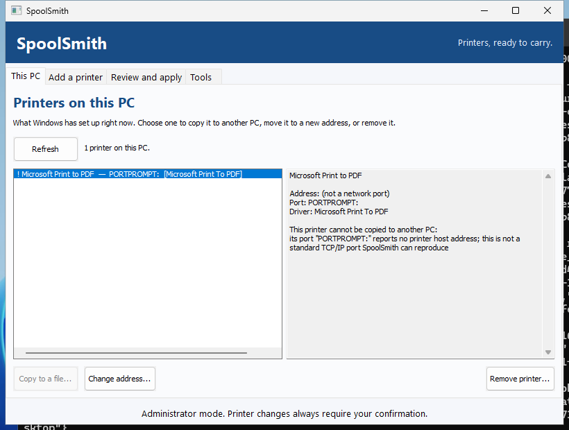

# SpoolSmith

<p align="center"></p>

**Copy a working Windows printer into a file, driver included, and set it up on the next PC
after reviewing exactly what will change.**

SpoolSmith is a signed command-line tool and desktop app for the printer setup IT support keeps
repeating. Copy one printer or a whole PC's worth, double-click the file on the next PC, check
the plan, and confirm once.

[**Download for Windows**](https://github.com/spilloid/spoolsmith/releases/latest) ·
[**Documentation**](https://spilloid.github.io/spoolsmith/guide/) ·
[Product site](https://spilloid.github.io/spoolsmith/) ·
[Release notes](releases/)



## Copy a printer

**In the desktop app:** on the PC that already prints, select printers on **This PC** and
choose **Copy 1 printer...** (or **Copy N printers...** for a `.zip` set). On the next PC,
double-click the file, check the steps on the apply sheet, and confirm.

**On the command line**, in an administrator PowerShell:

```powershell
# On the PC that already prints
.\spoolsmith.exe copy "Accounting" --out accounting.ssb

# On the PC that needs it
.\spoolsmith.exe apply accounting.ssb --dry-run   # preview: changes nothing
.\spoolsmith.exe apply accounting.ssb             # same plan, one confirmation
```

The copy carries the driver whenever it can be exported. `apply` checks that the printer
still reports the same model; if it isn't answering, setup falls back to the saved settings
and says so first. Re-running is safe: matching settings are left alone.

→ [Full walkthrough](https://spilloid.github.io/spoolsmith/guide/copy.html): whole-PC sets,
USB and WSD printers, driver trust, and rolling one reviewed plan out to many PCs.

## What else it does

| | |
|---|---|
| **Set up by address** | Let Windows set up an IPP printer and find its own driver, or pick an installed driver yourself. [Guide →](https://spilloid.github.io/spoolsmith/guide/profiles.html) |
| **Saved setups** | Keep printers as `.ssb` files to add, update, check or remove on any PC, and move the whole library as one `.zip`. [Guide →](https://spilloid.github.io/spoolsmith/guide/profiles.html#add-update-and-remove) |
| **Intune packaging** | Turn a printer file into a reviewable Win32 app and `.intunewin`. Local only; it never signs in to a tenant. [Guide →](https://spilloid.github.io/spoolsmith/guide/intune.html) |
| **Discovery** | Scan a subnet and see what each printer reports. [Guide →](https://spilloid.github.io/spoolsmith/guide/profiles.html#find-printers-on-the-network) |

## Built to be boring

- **You see every step before Windows changes.** Drivers, ports, queues and trusted publishers are all listed in the plan you confirm.
- **No guessing.** A printer reporting a different identity stops setup; it never becomes an install.
- **Downloads nothing itself, asks for no credentials.** Drivers come from the printer file, what's installed, or Windows' own driver search.
- **Plain files.** A `.ssb` is a zip; a set is a zip of `.ssb` files. Neither contains commands.

## Install

Every [release](https://github.com/spilloid/spoolsmith/releases/latest) has the same two
signed programs, `spoolsmith-gui.exe` and `spoolsmith.exe`, as a **portable ZIP** (no install,
no admin) or an **MSI** (Program Files, Start Menu, silent install for deployment tools).
Check what you downloaded:

```powershell
Get-AuthenticodeSignature .\spoolsmith.exe | Format-List Status, SignerCertificate   # Status: Valid
```

**Requirements:** Windows x64. Supported printers are RAW TCP 9100 by IP or hostname, verified
WSD, IPP through Windows automatic setup, and USB. See
[Safety and limits](https://spilloid.github.io/spoolsmith/guide/status.html) for exactly what's
supported and what's been verified on real hardware.

**Upgrading from v1.0 or earlier?** Bare JSON profiles are no longer read. Recreate them by
copying the installed printer or with `profile capture`.
[Details](https://spilloid.github.io/spoolsmith/guide/start.html#upgrading-from-v1-0-or-earlier).

## Documentation

| Start here | Reference |
|---|---|
| [Install and first run](https://spilloid.github.io/spoolsmith/guide/start.html) | [Command line](https://spilloid.github.io/spoolsmith/guide/cli.html) |
| [Copy a printer](https://spilloid.github.io/spoolsmith/guide/copy.html) | [Desktop app](https://spilloid.github.io/spoolsmith/guide/desktop.html) |
| [Set up by address, and saved setups](https://spilloid.github.io/spoolsmith/guide/profiles.html) | [Safety model and limits](https://spilloid.github.io/spoolsmith/guide/status.html) |
| [Package for Intune](https://spilloid.github.io/spoolsmith/guide/intune.html) | [Roadmap](docs/roadmap.md) · [Validation records](docs/validation/) |

Deployment details: [MSI installer](installer/README.md) · [Code signing](docs/code-signing.md) ·
[Intune deployment reference](docs/intune-deployment.md) · [Desktop/CLI parity](docs/gui-parity.md)

## Building and contributing

Requires Go 1.24+. The detection core is OS-independent and tested anywhere; changing printers
is Windows-only.

```sh
go build ./...
go test ./...
go build -ldflags="-H windowsgui" -o dist/spoolsmith-gui.exe ./cmd/spoolsmith-gui   # desktop, on Windows
```

Desktop UI tests (`test/gui`, FlaUI) need a Windows desktop session:
`dotnet test test/gui/SpoolSmithGui.Tests`, or the manual **Desktop validation** workflow.
`SPOOLSMITH_CAPTURE_SITE_SHOTS=1` regenerates the site's screenshots from the running app. The
engineering record (specs, the review log with every defect found and fixed, and hardware
runbooks) is in [`docs/development/`](docs/development/).

Bugs and ideas: [open an issue](https://github.com/spilloid/spoolsmith/issues).

## License

MIT. See [LICENSE](LICENSE).
